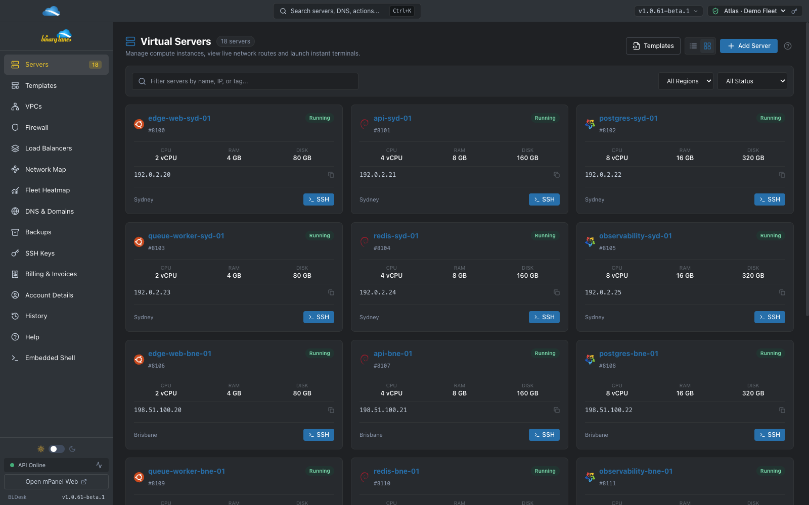
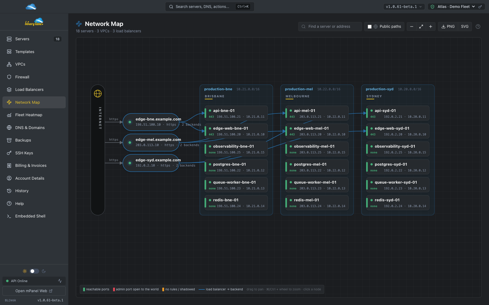
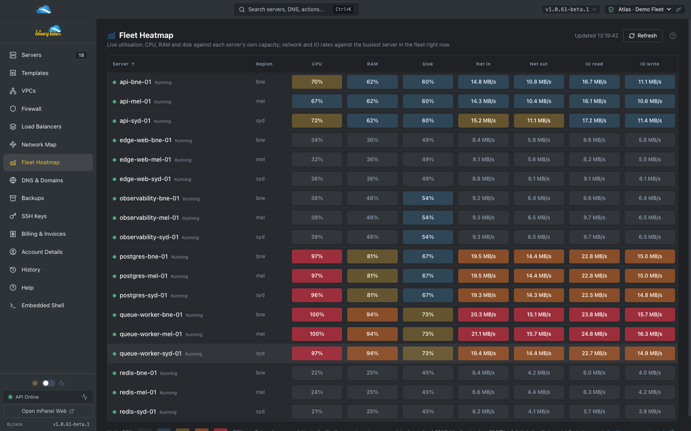
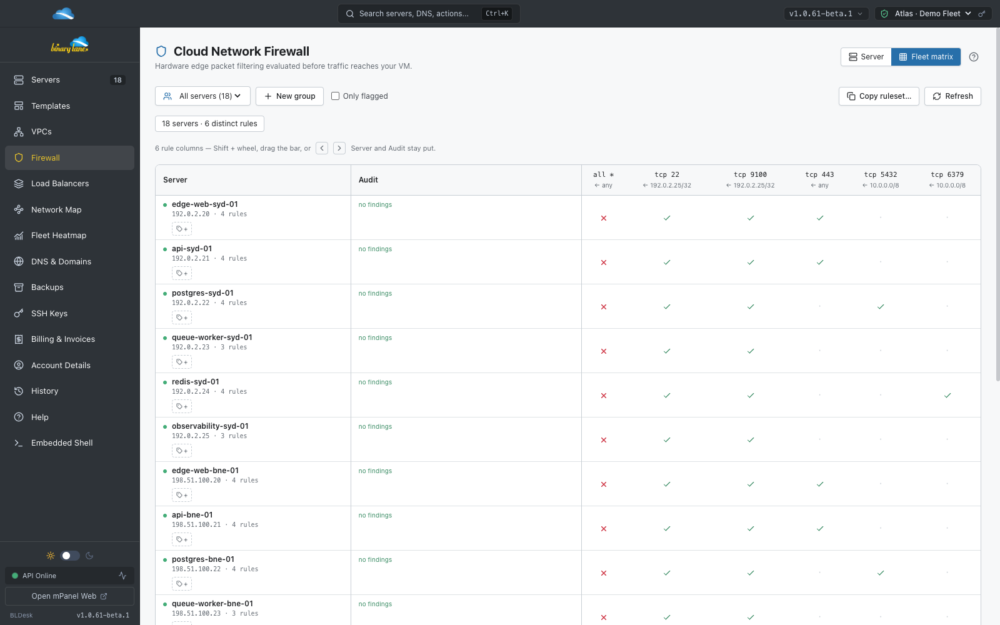
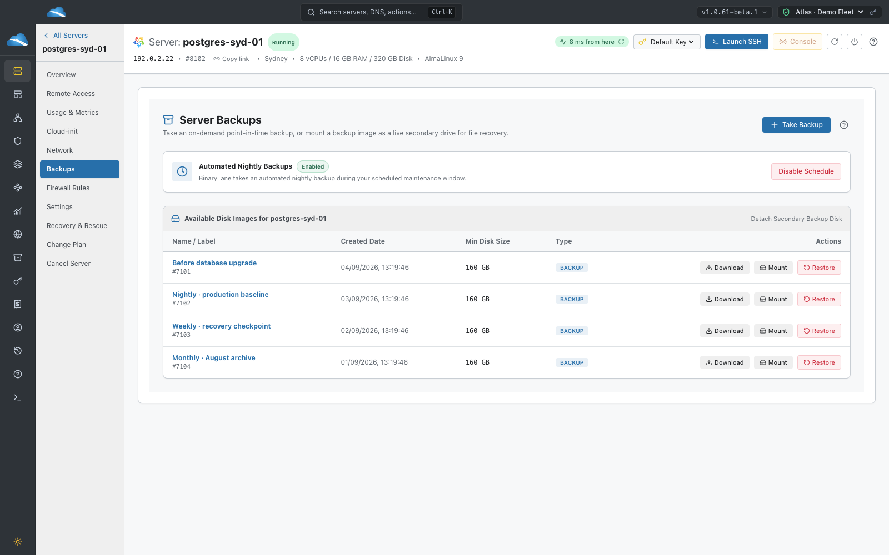
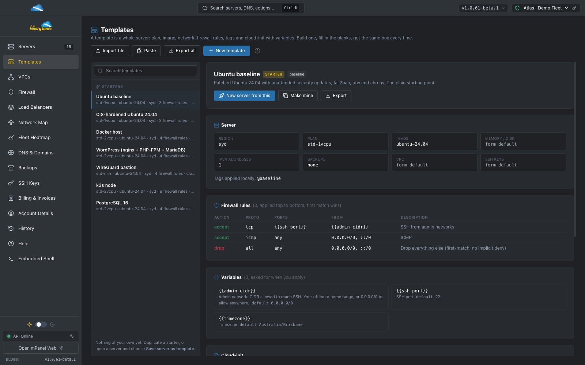
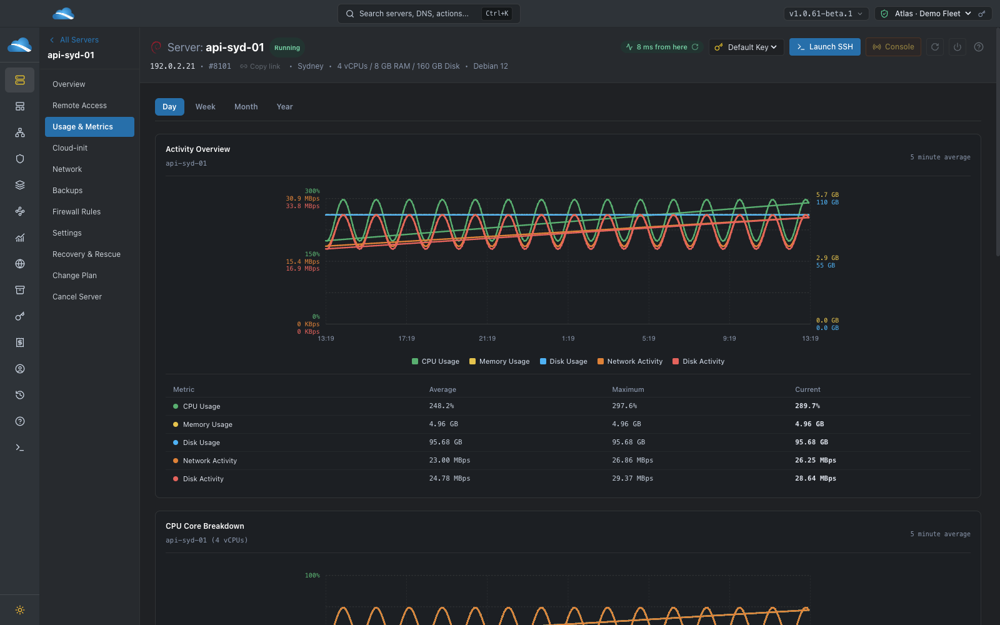
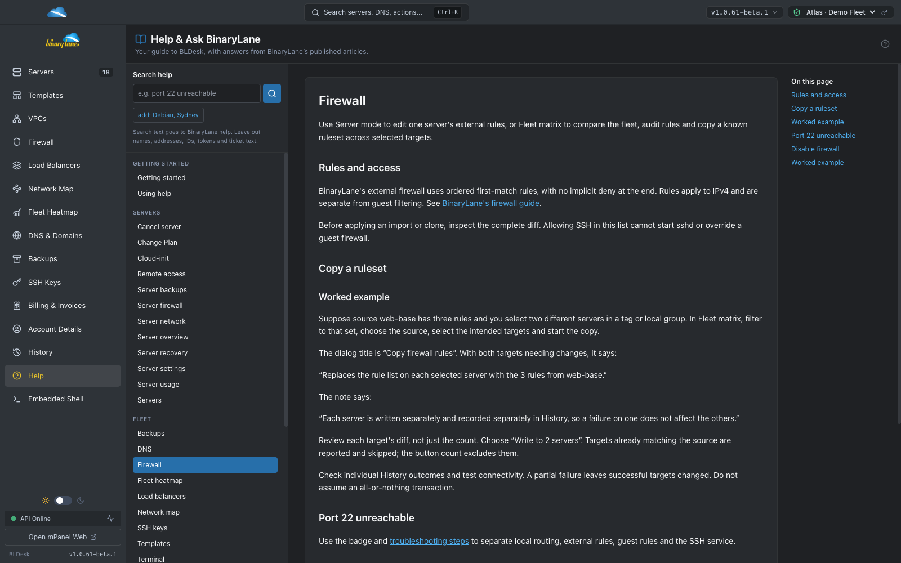

# BLDesk (BinaryLane Desktop) ⚡

[](#platform-support)
[](#tech-stack)
[](#tech-stack)
[](#tech-stack)
[](#tech-stack)
[](#api-coverage)

A modern, high-performance, cross-platform desktop management client for [BinaryLane Cloud](https://www.binarylane.com.au), designed with official **PanelSite (mPanel)** look and feel, multi-account token vaults, and desktop native capabilities.

---

## What you can do

BLDesk brings BinaryLane account management together with fleet-wide views and local desktop tools. Features below are implemented in the current source; [FEATURES.md](FEATURES.md) separates the inventory from the roadmap.

- **Manage a fleet:** grid/list views, filters, server controls and one active account profile at a time.
- **See the whole network:** regional/VPC topology, load-balancer backends and firewall-derived exposure, with SVG/PNG export.
- **Compare utilisation:** a sortable fleet heatmap plus per-server CPU, memory, storage and network history.
- **Review firewall changes:** ordered IPv4 rules, a fleet matrix, audit flags, local tags/groups and per-target diffs when copying rulesets.
- **Build repeatably:** whole-server YAML templates, built-in starters, variables and capture from an existing server, followed by the Create Server review.
- **Change plans deliberately:** resources, licences, backup/offsite options, pre-action backup, monthly-cost comparison and explicit review of address releases or reinstall.
- **Recover and inspect:** on-demand backups, slot/replacement selection, restore, read-only backup attachment, download links and nightly schedule controls.
- **Work quickly:** a verb-first command palette with glob/ID/IP/tag targets, native SSH handoff, desktop TCP reachability/traceroute and server/help deep links.
- **Follow outcomes:** page-action confirmation dialogs, change tables/diffs, typed irreversible confirmations, local per-profile History and running-action tracking.
- **Manage account resources:** hosted DNS zones and record add/delete, SSH public keys, VPC membership, load-balancer pools, account details and billing.
- **Keep guidance close:** 33 bundled help pages, contextual links and Ask BinaryLane answers with source articles. Local help remains usable offline.
- **Use desktop conveniences:** light/dark themes, 80–150% zoom, tray shortcuts/notifications and update channels; Android uses a Capacitor shell and native HTTP.

The palette has its own target-list review; Create Server uses its form. The terminal is a **native SSH handoff, not an embedded session**. DNS editing, VPC route editing and load-balancer health-check configuration are not exposed in this client; see [implemented boundaries](FEATURES.md#important-boundaries). Secure credential storage has fallback paths, so a protected device remains important.

## Screenshots

Real BLDesk, populated entirely with a fictional **Atlas Cloud demo fleet**: 18 servers across Sydney, Brisbane and Melbourne, three VPCs and three load balancers. Names, addresses, metrics, balances and backup records are synthetic. No live account was used. [Capture recipe and source checks](docs/SHOWCASE.md).

### Fleet dashboard


### Network topology


### Fleet utilisation


### Firewall matrix


### Backup recovery


<details>
<summary>More: templates, performance history and built-in help</summary>





</details>

---

## ⌨️ Useful Keyboard Shortcuts

| Shortcut | Action |
| :--- | :--- |
| `Cmd + K` / `Ctrl + K` | Open Command Palette (search servers, VPCs, actions) |
| `Cmd/Ctrl + +` / `Cmd/Ctrl + -` | Zoom in / out (80–150%; `Cmd/Ctrl + =` also zooms in) |
| `Cmd/Ctrl + 0` | Reset zoom to 100% |
| `Cmd + R` / `F5` | Refresh & reload current view |
| `Cmd + Option + I` / `F12` | Toggle Developer Tools Inspector |

Desktop zoom is also available in the **View** menu (press `Alt` to reveal the menu on Windows/Linux). At larger zoom levels, navigation can switch to the compact layout; use the menu button or **More** to reach every section.

Open **Help** in the sidebar or click a page's circled **?** for bundled BLDesk documentation. In the palette, `?` lists commands, `help firewall` searches local topics, and `ask how do I enable ipv6` searches BinaryLane's published articles. Local results work offline; remote questions send only the search-box text, so leave account details and secrets out. The documentation source is [docs/help](docs/help), bundled with each app version.

---

## 🚀 Getting Started

### Prerequisites
* [Node.js](https://nodejs.org) (v20+ recommended)
* [npm](https://npmjs.com)

### Installation & Development
```bash
# Clone the repository
git clone https://github.com/termau/bldesk.git
cd bldesk

# Install dependencies
npm install

# Start local development server (with HMR)
npm run dev
```

### Packaging & Builds

```bash
# Build macOS application (.app, .dmg, .zip)
npm run build:mac

# Build Windows installer & portable package
npm run build:win

# Build Linux AppImage & deb
npm run build:linux
# Linux users: prefer the .deb on Ubuntu 23.10+/24.04 — the AppImage runs there
# too, but without the Chromium sandbox (AppArmor blocks user namespaces, and a
# setuid helper can't live inside a FUSE mount). AppImages also need libfuse2.

# Sync and prepare Android Capacitor build
npm run cap:sync
```

### 🚀 Cutting a New Release (with Auto-Update)

BLDesk supports cross-platform in-app auto-updating via `electron-updater` and GitHub Releases:

```bash
# 1. Bump version
npm version patch --no-git-tag-version

# 2. Commit and tag (tag must match version)
git commit -am "chore(release): v1.0.X"
git tag v1.0.X

# 3. Push commit & tag to trigger CI release workflow
git push && git push --tags
```

For more in-depth architectural and agent instructions, see [AGENTS.md](AGENTS.md) and [docs/AUTO_UPDATE.md](docs/AUTO_UPDATE.md).

---

## 🛠️ Architecture & Tech Stack

* **Runtime**: Electron + Node.js
* **Bundler**: `electron-vite` + `electron-builder`
* **Frontend**: React 18 + TypeScript + Tailwind CSS + Lucide Icons
* **Data Fetching**: TanStack Query v5 (React Query) with custom anti-spam client
* **Auto-Update**: `electron-updater` with multi-OS GitHub Release manifests
* **API Schema**: Strongly-typed OpenAPI fetch client generated from BinaryLane OpenAPI 3.0.4
* **Terminal**: `xterm.js` + `xterm-addon-fit` + `xterm-addon-web-links`
* **Mobile / Touch**: Capacitor for Android mobile deployments

---

## 📄 License
MIT © [termau](https://github.com/termau)
